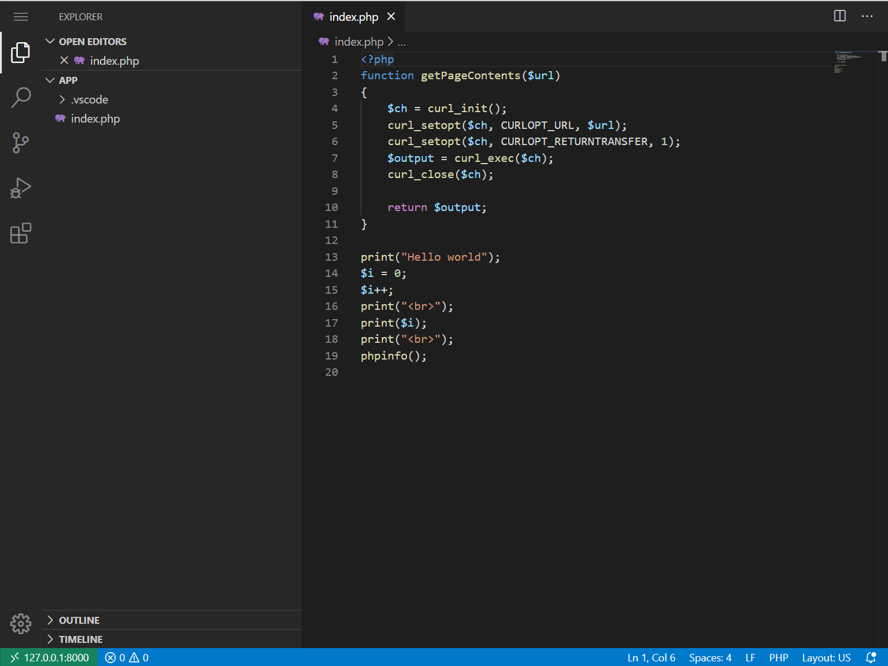

# devbox-php

A simple docker container with vscode you can use to start your php development without need to setup dependencies.

You can also debug either running php script or through HTTP.



# Running

On the folder you want to start your session you can do:
```
 docker run --rm -ti -p 8000:80 \
    --user=`id -u`:`id -g` livesourcing/devbox-php:latest \
    -v `pwd``:/app devbox-php:latest
```

After this, you can go into:
http://127.0.0.1:8000/_code/

And will open vscode

The website will be at:
http://127.0.0.1:8000

*Notes:* You can also use `devbox-php:7.3` to use php 7.3 instead latest 7.4


